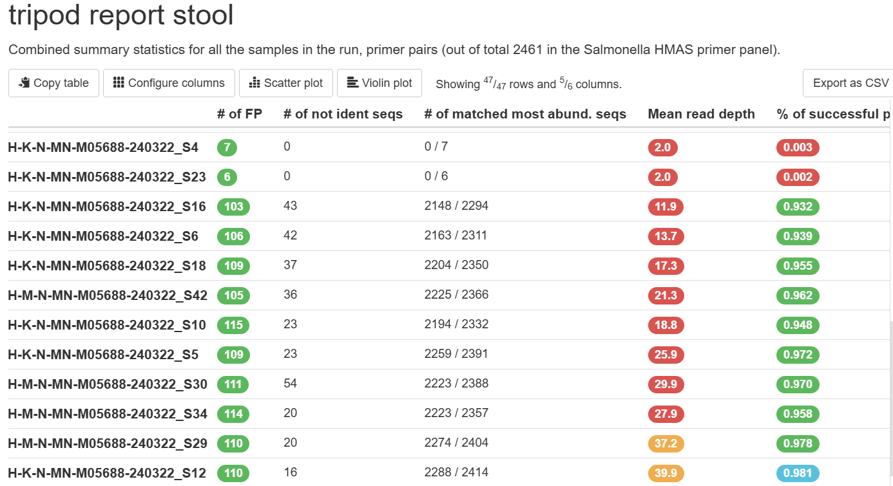
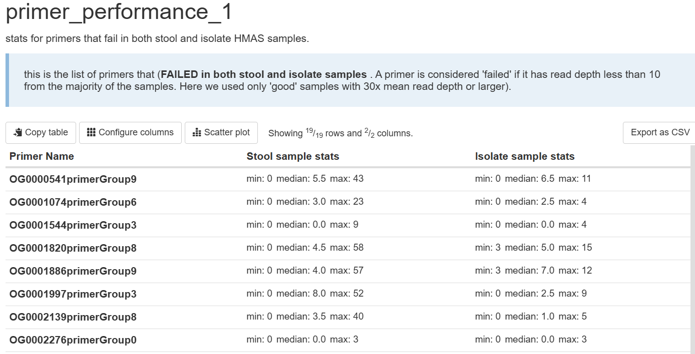

---

# Tripod Analysis Pipeline

The **Tripod analysis pipeline** processes:

* **HMAS stool data (SH)**
* **HMAS isolate data (IH)**
* **Optional: corresponding isolate WGS reads (IW)**

It compares HMAS results between isolate and stool samples and evaluates primer performance across datasets.

The pipeline supports two modes:

1. **Trio mode**
   Stool HMAS + Isolate HMAS + Isolate WGS reads

2. **Pair mode**
   Stool HMAS + Isolate HMAS only (WGS optional)

<p align="center"></p>  
<p align="center"></p>

---

## Installation

Create the Conda environment:

```bash
conda env create -f bin/tripod.yaml
```

---

## Running the Pipeline

```bash
nextflow run main.nf \
  --wgs_reads <folder containing paired-end fastq.gz files> \
  --hmas_indir_stool <folder containing stool HMAS step_mothur output> \
  --hmas_indir_isolate <folder containing isolate HMAS step_mothur output> \
  --primers <primer file for primersearch> \
  --mapping <3-column CSV mapping file> \
  --multiqc_config <MultiQC configuration file> \
  --outdir <output folder>
```

All parameters may alternatively be defined in `nextflow.config`.

---

## Input Requirements

### 1. Directory Structure

The three input directories:

* `--wgs_reads`
* `--hmas_indir_stool`
* `--hmas_indir_isolate`

may be **parent directories**.

The pipeline recursively searches subdirectories and matches files by sample names defined in the mapping file.

---

### 2. Mapping File Format (Required)

The mapping file must be a **3-column CSV**.

**Column order is mandatory.**

| Isolate (IH)   | Stool (SH)     | Isolate WGS (IW) |
| -------------- | -------------- | ---------------- |
| CIMS-OH-006-IH | CIMS-OH-200-SH | CIMS-OH-006-IH   |
| CIMS-OH-627-IH | CIMS-OH-627-SH | CIMS-OH-627-IH   |

Notes:

* In pair mode, WGS files may be absent.
* Matching is strictly name-based.

---

## WGS-Optional Behavior

If a WGS file is missing, the pipeline completes successfully.

The following metrics are set to **0**:

#### In `tripod_report_combined`:

* `# of ident seqs to insilico`  
* `% of ident seqs to insilico`

#### In `tripod_report_stool` and `tripod_report_isolate`:

* `# of not ident seqs`
* Numerator of `# of matched most abundant seqs`

---

## Primer Performance Reports

Primer performance is calculated using **good samples**, defined as:

> Samples with ≥ 90% primer success rate.

Filtering behavior:

| Dataset      | 90% Threshold Checked Automatically? |
| ------------ | ------------------------------------ |
| Stool HMAS   | Yes                                  |
| Isolate HMAS | No (assumed to pass)                 |

If primer success rate is important for isolate samples, filter them in the mapping file before running the pipeline.


### similarly, in the Good Sample Output

File:

```
combined_output_*_goodsamples.csv
```

* Stool HMAS samples → already filtered (≥90%)
* Isolate HMAS samples → not validated for threshold

---


## Notices

### Public Domain Notice
This repository constitutes a work of the United States Government and is not
subject to domestic copyright protection under 17 USC § 105. This repository is in
the public domain within the United States, and copyright and related rights in
the work worldwide are waived through the [CC0 1.0 Universal public domain dedication](https://creativecommons.org/publicdomain/zero/1.0/).
All contributions to this repository will be released under the CC0 dedication. By
submitting a pull request you are agreeing to comply with this waiver of
copyright interest. 

### License Standard Notice

### Privacy Notice
This repository contains only non-sensitive, publicly available data and
information. All material and community participation is covered by the
[Disclaimer](https://github.com/CDCgov/template/blob/master/DISCLAIMER.md)
and [Code of Conduct](https://github.com/CDCgov/template/blob/master/code-of-conduct.md).
For more information about CDC's privacy policy, please visit [http://www.cdc.gov/other/privacy.html](https://www.cdc.gov/other/privacy.html).

### Contributing Notice
Anyone is encouraged to contribute to the repository by [forking](https://help.github.com/articles/fork-a-repo)
and submitting a pull request. (If you are new to GitHub, you might start with a
[basic tutorial](https://help.github.com/articles/set-up-git).) By contributing
to this project, you grant a world-wide, royalty-free, perpetual, irrevocable,
non-exclusive, transferable license to all users under the terms of the
[Apache Software License v2](http://www.apache.org/licenses/LICENSE-2.0.html) or
later.

All comments, messages, pull requests, and other submissions received through
CDC including this GitHub page may be subject to applicable federal law, including but not limited to the Federal Records Act, and may be archived. Learn more at [http://www.cdc.gov/other/privacy.html](http://www.cdc.gov/other/privacy.html).

### Records Management Notice
This repository is not a source of government records, but is a copy to increase
collaboration and collaborative potential. All government records will be
published through the [CDC web site](http://www.cdc.gov).
